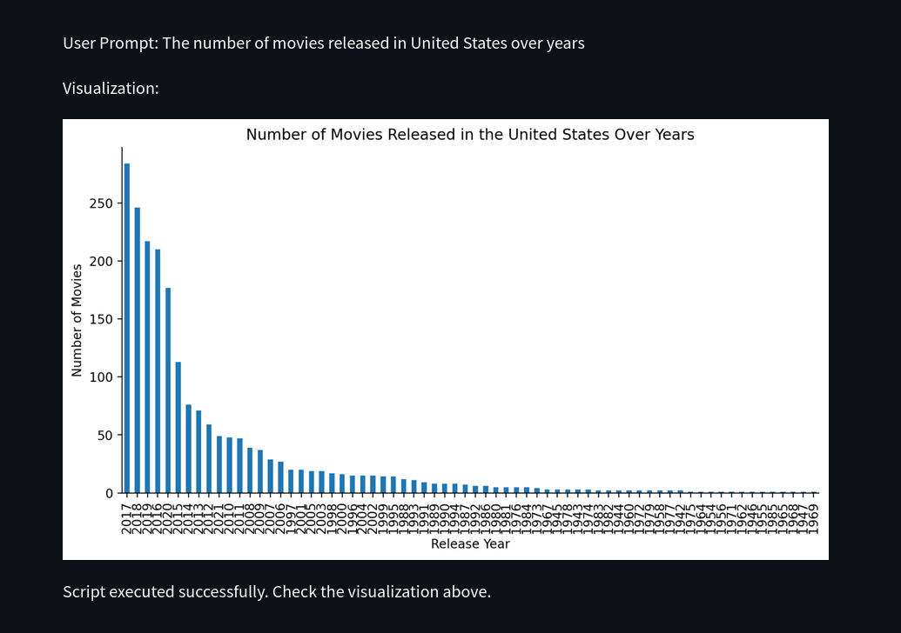

# Chat2Vis

## Overview
Chat2Vis is a demonstration project that uses the Gemini API to generate data visualization scripts via natural language input. The generated scripts are then displayed using Streamlit as a web application.

The main part of this pet project is desctiption prompt and code prompt which are sent to model using API_KEY.
- Description prompt: contains information about schema of dataset including feature names, data types respectively, some requirements for generated script, specific python version you prefer.
- Code prompt: contains the specific instructions for generating the visualization script.

    

## Features
- Generate data visualization scripts using natural language prompts.
- Supports multiple datasets including `netflix_titles.csv` and `StudentsPerformance.csv`.
- Interactive web application built with Streamlit.


## Setup

1. **Clone the repository:**
    ```sh
    git clone 'https://github.com/nngiaminh1812/Chat2Vis.git'
    ```

2. **Install dependencies:**
    ```sh
    pip install -r requirements.txt
    ```

3. **Set up environment variables:**
    - Create a `.env` file in the root directory.
    - Add your Gemini API key to the `.env` file:
        ```
        API_KEY='your_gemini_api_key'
        ```

## Usage

1. **Run the Streamlit application:**
    ```sh
    streamlit run demo.py
    ```
    

2. **Interact with the web app:**
    - Select a dataset from the dropdown menu.
    - Enter a natural language prompt to generate a data visualization script.
    - View the generated visualization.
    
    - In the case if you want model to use specific chart, you can refine prompt like this.
    

## Files

- **`chatbox.py`**: Contains functions to interact with the Gemini API.
- **`demo.py`**: Main Streamlit application file.
- **`netflix_titles.csv`**: Sample dataset of Netflix titles on kaggle.
- **`StudentsPerformance.csv`**: Sample dataset of student performance on kaggle.
- **`.env`**: Environment variables file containing the API key.

## License
This project is licensed under the Apache License 2.0. See the [LICENSE](LICENSE) file for details.